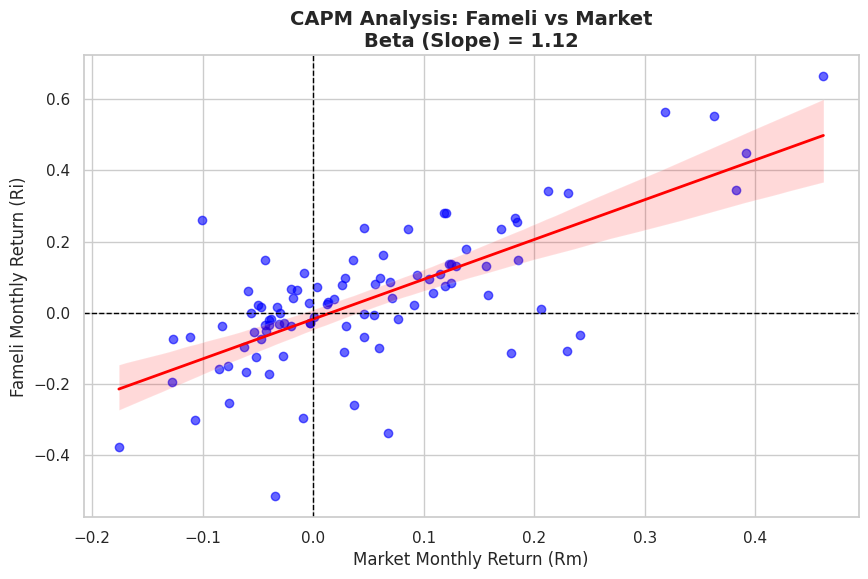

در این کد به بررسی بتای سهام فملی از بارار بورس تهران پرداخته شده 
ابتدا داده های مورد نیاز به کمک هوش مصنوعی اسکرپ شده در ادامه داده های اسکرپ شده با استفاده از اکسل تمیز شده و با کتابخانه های pandas , plotlib , seaborn تجزیه و تحلیل و مصور شده است 
باید توچه داشت که تاریخی بودن داده ها و ناتوانی مدل capm در تعریف بسیاری از موارد بازار مثل رفتار های هیجانی از توضیح دهدندگی این بتا کاهسته است و این پروژه صرفا یک تمرین شخصی میباشد 
در نتیجه این پروژه تک سهم فملی دارای بتای 1.12 میباشد که در گروه سهم های هجومی میباشد که در روند های صودی پیشرو تر از بازار و در زمان رکود نیازمند مدیریت ریسک است 

